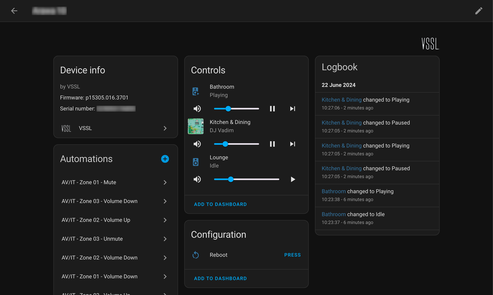

# VSSL
Home Assistant integration using [vsslctrl](https://github.com/vsslctrl/vsslctrl) for controlling [VSSL](https://www.vssl.com/) range of streaming amplifiers.

## Installation

### Home Assistant Community Store (HACS)

If you dont have HACS installed, follow [documentation here](https://hacs.xyz/docs/setup/prerequisites)

1. Open HACS in Home Assistant
2. Select `Custom Repositories` using the 3 dots in top right
3. Add `https://github.com/vsslctrl/integration.home-assistant`
4. Select `Integration` as category
4. Search `VSSL` in `Repository Name`, download it and restart HA
5. Go to `settings` -> `Devices & Service` -> `Add Intigration` and search for `VSSL`
6. Follow prompts to add VSSL device

Important
-----------
Only tested on a VSSL **A.3x** software version **p15305.016.3701**.

**Notice:** VSSLs new iOS app titled `VSSL`can cause connection refused issues if running at the same time as `vsslctrl`. Best to not use the iOS app togeather. The `VSSL Legacy` app works fine

**Warning:** no *[VSSL Agent](https://vssl.gitbook.io/vssl-rest-api/getting-started/start)* should be running on the same network. If you dont know what this is, then you can probably ignore this notice.

**...TODO**
- Discovery (vsslctrl already has function)
- More functions e.g EQ