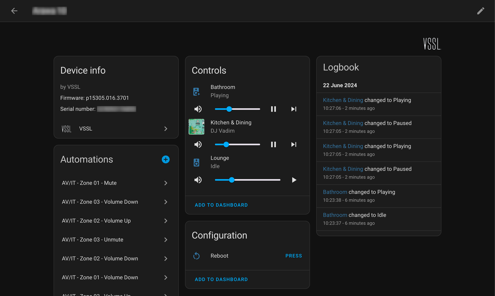

# VSSL
Home Assistant integration based on [vsslctrl](https://github.com/vsslctrl/vsslctrl) for controlling [VSSL's](https://www.vssl.com/) range of streaming amplifiers.

## Testers Needed
Looking for **A1** and **A.1x** testers, please get in touch if your interested in helping: <vsslcontrolled@proton.me>

## Coverage

Tested on:
| Model       | Software Version | User Reported |
| ------------|---------  | -------------
| A.1       | p15265.033.3703    | ✔️
| A.3       | p12013.141.3703     | ✔️
| A.3x       | p15305.016.3701     | 
| A.6x       | p15305.017.3701     | ✔️

## Important

There should not be any *[VSSL Agent's](https://vssl.gitbook.io/vssl-rest-api/getting-started/start)* running on the network. If you dont know what this is, then you can ignore this notice.

 **`vsslctrl` is not endorsed or affiliated with [VSSL](https://www.vssl.com/) in any manner.**

## Installation

### Home Assistant Community Store (HACS)

If you dont have HACS installed, follow [documentation here](https://hacs.xyz/docs/setup/prerequisites)

1. Open HACS in Home Assistant
2. Select `Custom Repositories` using the 3 dots in top right
3. Add `https://github.com/vsslctrl/integration.home-assistant`
4. Select `Integration` as category
4. Search `VSSL` in `Repository Name`, download it and restart HA
5. Go to `settings` -> `Devices & Service` -> `Add Integration` and search for `VSSL`
6. Follow prompts to add VSSL device

**...TODO**
- Discovery (vsslctrl already has function)
- More functions e.g EQ