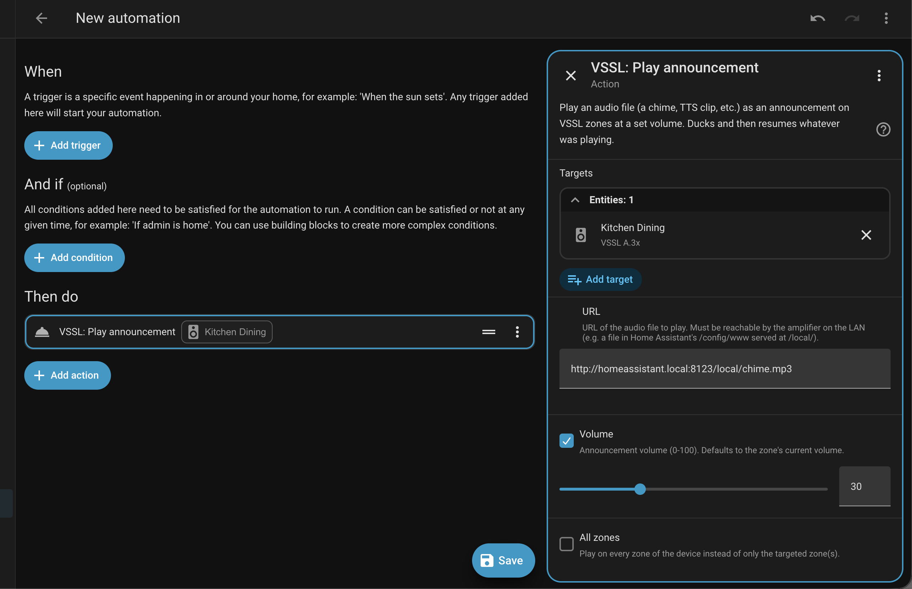

# VSSL
Home Assistant integration based on [vsslctrl](https://github.com/vsslctrl/vsslctrl) for controlling [VSSL's](https://www.vssl.com/) range of streaming amplifiers.

## Coverage

Tested on:
| Model       | Software Version | User Reported |
| ------------|---------  | -------------
| `A.1`       | p15265.033.3703    | ✔️
| `A.1x`    | p15243.022.3703 	|
| `A.3`       | p12013.141.3703     | ✔️
| `A.3x`       | p15305.016.3701     | 
| `A.6x`       | p15305.017.3701     | ✔️

## Important

There should not be any *[VSSL Agent's](https://vssl.gitbook.io/vssl-rest-api/getting-started/start)* running on the network. If you dont know what this is, then you can ignore this notice.

 **`vsslctrl` is not endorsed or affiliated with [VSSL](https://www.vssl.com/) in any manner.**

## Installation

### Home Assistant Community Store (HACS)

If you dont have HACS installed, follow [documentation here](https://hacs.xyz/docs/setup/prerequisites)

1. Open HACS in Home Assistant
2. Select `Custom Repositories` using the 3 dots in top right
3. Add `https://github.com/vsslctrl/integration.home-assistant`
4. Select `Integration` as category
4. Search `VSSL` in `Repository Name`, download it and restart HA
5. Go to `settings` -> `Devices & Service` -> `Add Integration` and search for `VSSL`
6. Follow prompts to add VSSL device

## Playing Announcements

The `vsslctrl.play_announcement` service plays an audio URL as an announcement on one or
more VSSL zones — ducking and then resuming current playback automatically. A common use
case is playing a door chime via automation.

1. **Get an audio file** — e.g. a chime from [SoundBible](https://soundbible.com/).
2. **Host it locally** so VSSL can reach it over your network: upload it to `/config/www`
   (e.g. via the **File Editor** add-on) and rename it to something simple, like `chime.mp3`.
   It's then served at `http://homeassistant.local:8123/local/chime.mp3`.
3. **Create an automation** with your desired trigger/conditions, and add the
   **VSSL: Play announcement** action.
4. **Configure the action:**
   - **Target** — the VSSL zone(s) to play on
   - **URL** — your hosted file's address
   - **All zones** *(optional)* — play on every zone regardless of target
   - **Volume** *(optional)* — announcement volume, independent of current playback volume
5. **Save and test** the automation.

**...TODO**
- Discovery (vsslctrl already has function)
- More functions e.g EQ No newline at end of file